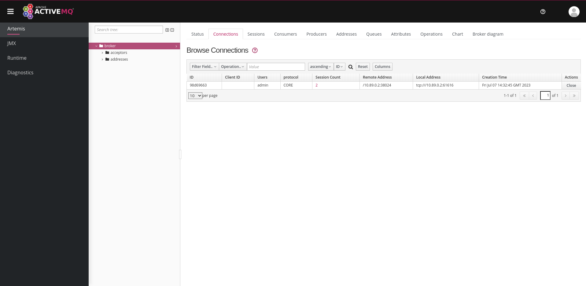
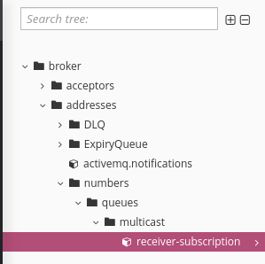

= Camel JMS: ClientID not set
:author: Marco Bungart

== Reproducer
.Building the application
[source, bash]
----
./mvnw clean package
----

.Starting JMS broker
[source, bash]
----
docker-compose \
  --file local-deployment/docker-compose.yml \
  up --detach
----

.Starting the application
[source, bash]
----
java -jar target/camel-jms-1.0-SNAPSHOT-executable-jar.jar
----

Observe that the application is sending and receiving messages.

Access the broker at link:http://localhost:8161/console[], login with and username/password combination (Artemis is running in dev mode, authentication is not verified)

Look at the "Connections"-tab and notice that the client does not have a client-ID set:

Navigate down to broker -> addresses -> numbers -> queues -> multicast, observe that the queue is named "receiver-subscription", which is the subscription name configured. However, it should be a combination of the client id (which is set to "receiver-client") and the subscription name:

